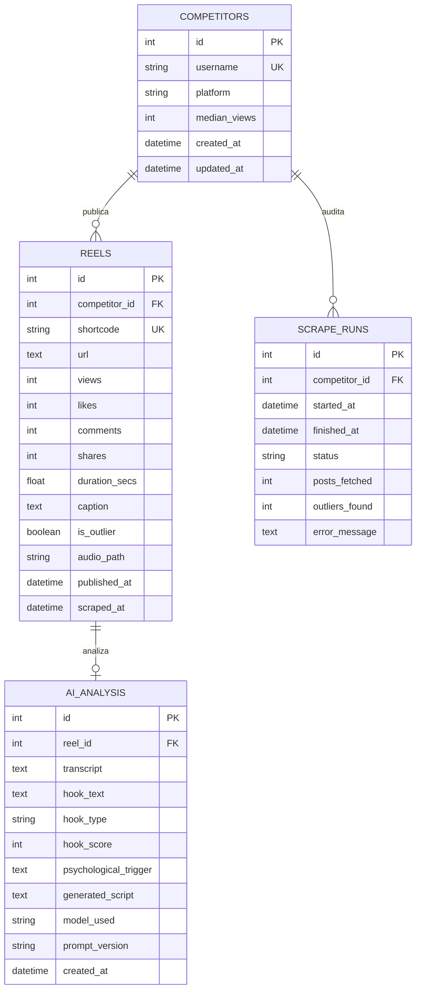

# 🎯 Instagram Viral Content Scraper & AI Analyzer

Sistema local en Python diseñado para **descubrir, extraer, transcribir y analizar con IA** los Reels más virales (*outliers* estadísticos) de cuentas de Instagram de la competencia, generando análisis psicológicos de retención y propuestas de guiones adaptados.

> [!TIP]
> **100% Flexible en IA**: Puedes usar **Google Gemini API** (rápido y en la nube) o **Ollama Local** (100% gratuito, offline y sin costo de tokens).

---

## ⚡ Características Principales

* 📊 **Extracción Inteligente (Scraper)**: Conexión vía `Instaloader` con manejo de sesiones cacheadas, control de *rate limiting* y extracción de métricas clave (reproducciones, likes, comentarios, duración, captions).
* 📈 **Detección Estadística de Outliers**: Calcula la mediana histórica de visualizaciones de la cuenta y clasifica automáticamente los videos virales según un multiplicador configurable ($\ge 3.0\times$ la mediana).
* 🎵 **Descarga Automatizada de Audio**: Descarga la pista de audio (`.mp3`) de los Reels catalogados como virales mediante `yt-dlp`.
* 🎙️ **Transcripción Local Ultrarrápida (STT)**: Motor local `faster-whisper` optimizado para GPU NVIDIA con CUDA (`float16` en RTX 3060 de 12GB) con fallback automático a CPU.
* 🧠 **Análisis Cognitivo y Neuromarketing (Doble Motor LLM)**:
  * **Opción A - Google Gemini**: `gemini-2.5-flash` ultrarrápido vía API.
  * **Opción B - Ollama Local**: Modelos abiertos (`llama3.1:8b`, `gemma2:9b`, `mistral`, `qwen2.5`) corriendo 100% en tu hardware local sin costo.
  * Extrae la frase exacta del gancho inicial (0-3s).
  * Clasifica la tipología del gancho (*pregunta, shock, curiosidad, dolor, polémica, transformación*).
  * Califica la efectividad del gancho de 1 a 10.
  * Explica los gatillos psicológicos y sesgos cognitivos de retención.
  * Genera un guion estructurado paso a paso listo para grabar.
* 💾 **Persistencia Relacional**: Almacenamiento estructurado en SQLite mediante SQLAlchemy 2.0 (cuentas, reels, análisis y registro de auditoría).
* 📱 **Alertas Opcionales a Telegram**: Envío automático de resúmenes formateados en Markdown a tu canal o chat privado.

---

## 🛠️ Stack Tecnológico

| Capa | Tecnología | Propósito |
|---|---|---|
| **Lenguaje Core** | Python 3.10+ | Lógica principal, tipado estricto y scripting |
| **Extracción** | `instaloader` | Scraping de posts y reels con manejo de sesiones |
| **Descarga Multimedia** | `yt-dlp` | Extracción de pistas de audio en formato `.mp3` |
| **Transcripción (STT)** | `faster-whisper` (`large-v3`) | Speech-To-Text local acelerado por hardware CUDA |
| **Razonamiento IA (Nube)** | `google-genai` (`gemini-2.5-flash`) | Análisis cognitivo y generación de guiones con Gemini |
| **Razonamiento IA (Local/Gratis)** | `Ollama` (`llama3.1:8b` / `gemma2`) | Análisis 100% offline y gratuito en tu propia máquina |
| **Manejo de Datos** | `pandas` | Limpieza de datos y cálculo de medianas estadísticas |
| **Base de Datos** | SQLite + `SQLAlchemy 2.0` | Persistencia relacional local sin dependencias externas |
| **Configuración** | `pydantic-settings` + `python-dotenv` | Configuración tipada y validación desde `.env` |
| **Terminal / CLI** | `rich` + `argparse` | Formato visual con tablas, paneles y barras de progreso |
| **Testing** | `pytest` | Pruebas unitarias automatizadas |

---

## 📁 Estructura del Proyecto

```
Scrapper/
├── config/                          # Especificaciones y requerimientos originales
│   ├── spec.md
│   ├── Tecnology.md
│   └── Base de datos.md
├── data/                            # Directorio generado en tiempo de ejecución (ignorado en Git)
│   ├── scrapper.db                  # Base de datos SQLite
│   ├── audio/                       # Archivos de audio descargados (.mp3)
│   └── sessions/                    # Sesiones de login de Instagram
├── src/
│   └── scrapper/
│       ├── __init__.py              # Inicialización del paquete
│       ├── __main__.py              # Punto de entrada para ejecución modular
│       ├── config.py                # Configuración y variables con Pydantic Settings
│       ├── db.py                    # Modelos relacionales SQLAlchemy y fábrica de sesiones
│       ├── scraper.py               # Extractor de Instagram con rate-limiting
│       ├── outlier.py               # Cálculo de mediana y detección de outliers virales
│       ├── transcriber.py           # Descargador yt-dlp y wrapper de faster-whisper
│       ├── analyzer.py              # Motores LLM: Gemini API y Ollama Local + Parser JSON
│       ├── telegram.py              # Integración de alertas vía Telegram Bot API
│       └── main.py                  # Orquestador del pipeline completo
├── tests/                           # Suite de pruebas unitarias
│   ├── __init__.py
│   ├── test_outlier.py              # Tests de lógica matemática y umbrales
│   ├── test_analyzer.py             # Tests de parseo de JSON, Gemini y Ollama
│   └── test_db.py                   # Tests de persistencia con SQLite en memoria
├── .env.example                     # Plantilla de variables de entorno
├── .gitignore                       # Filtro de archivos para control de versiones
├── pyproject.toml                   # Configuración del paquete y herramientas
├── requirements.txt                 # Dependencias congeladas
└── README.md                        # Documentación del proyecto
```

---

## 🚀 Instalación y Puesta en Marcha

### 1. Clonar el repositorio y acceder
```bash
git clone <url-del-repositorio>
cd Scrapper
```

### 2. Crear y activar el entorno virtual
En Windows (PowerShell):
```powershell
python -m venv .venv
.\.venv\Scripts\Activate.ps1
```

En Linux / macOS:
```bash
python3 -m venv .venv
source .venv/bin/activate
```

### 3. Instalar dependencias
```bash
pip install -r requirements.txt
pip install -e .
```

> [!NOTE]
> Para la descarga de audio y procesamiento multimedia, se recomienda tener instalado **FFmpeg** en tu sistema operativo y disponible en el `PATH`.

---

## 🦙 Configuración de Ollama (100% Local y Gratis)

Si prefieres no usar la API de Google Gemini para evitar costos de tokens, puedes usar **Ollama**:

1. Descarga e instala Ollama desde [ollama.com](https://ollama.com).
2. Descarga tu modelo favorito (recomendado para tu GPU RTX 3060 de 12GB):
   ```bash
   ollama run llama3.1:8b
   # O alternativas excelentes:
   # ollama run gemma2:9b
   # ollama run qwen2.5:7b
   ```
3. En tu archivo `.env`, cambia:
   ```env
   LLM_PROVIDER=ollama
   OLLAMA_BASE_URL=http://localhost:11434
   OLLAMA_MODEL=llama3.1:8b
   ```

---

## ⚙️ Configuración General (`.env`)

Copia la plantilla `.env.example` a `.env`:
```bash
cp .env.example .env
```

Edita `.env` con tus preferencias y claves:
```env
# --- Credenciales de Instagram (Opcional pero recomendado para evitar bloqueos) ---
INSTAGRAM_USERNAME=tu_usuario
INSTAGRAM_PASSWORD=tu_password

# --- Configuración del Pipeline ---
OUTLIER_MULTIPLIER=3.0        # Multiplicador sobre la mediana (ej. 3x)
MAX_POSTS_PER_ACCOUNT=50     # Cantidad de posts a extraer por cuenta
REQUEST_DELAY_SECONDS=3.0    # Pausa de cortesía entre peticiones

# --- Whisper (STT) ---
WHISPER_MODEL=large-v3       # tiny, base, small, medium, large-v3
WHISPER_DEVICE=cuda          # cuda o cpu
WHISPER_COMPUTE_TYPE=float16 # float16 (para GPU), int8 o float32

# --- Elección de Motor LLM ('gemini' o 'ollama') ---
LLM_PROVIDER=gemini

# --- Gemini API (Nube) ---
GEMINI_API_KEY=AIzaSy...     # Clave de Google AI Studio
GEMINI_MODEL=gemini-2.5-flash

# --- Ollama (Local y Gratis) ---
OLLAMA_BASE_URL=http://localhost:11434
OLLAMA_MODEL=llama3.1:8b

# --- Alertas de Telegram (Opcional) ---
TELEGRAM_BOT_TOKEN=
TELEGRAM_CHAT_ID=

# --- Rutas de Almacenamiento ---
DB_PATH=data/scrapper.db
AUDIO_DIR=data/audio
```

---

## 💻 Modos de Uso

### 0. Iniciar sesión en el navegador (Recomendado la primera vez)
Abre una ventana real de Google Chrome para que inicies sesión manualmente en Instagram (evita bloqueos 429 y checkpoints 2FA). La sesión quedará guardada permanentemente en `data/sessions/`:
```bash
python -m scrapper --login
```

### 1. Ejecutar con el motor LLM configurado por defecto
```bash
python -m scrapper cuenta_de_ejemplo
```

### 2. Forzar el uso de Ollama local (sin costo de API)
```bash
python -m scrapper cuenta_de_ejemplo --provider ollama
```

### 3. Forzar el uso de Gemini API
```bash
python -m scrapper cuenta_de_ejemplo --provider gemini
```

### 4. Ajustar cantidad de posts y umbral de viralidad
```bash
python -m scrapper cuenta_de_ejemplo --posts 25 --multiplier 3.5
```

### 5. Modo rápido (Solo Scraping + Detección de Outliers)
Inspecciona las métricas en consola sin descargar audios ni ejecutar IA:
```bash
python -m scrapper cuenta_de_ejemplo --skip-transcription
```

### 6. Modo detallado (Debug)
```bash
python -m scrapper cuenta_de_ejemplo --verbose
```

### 7. Ver ayuda de comandos
```bash
python -m scrapper --help
```

---

## 🗃️ Base de Datos Relacional

El sistema utiliza SQLite en `data/scrapper.db` con 4 tablas principales:



---

## 🧪 Pruebas Unitarias

Para validar todos los módulos del sistema (incluyendo tests de parseo de Gemini y fallback de Ollama):
```bash
pytest -v
```

Casos cubiertos:
- ✅ Cálculo exacto de mediana en listas pares, impares y vacías.
- ✅ Clasificación de publicaciones normales vs. outliers virales.
- ✅ Parseo robusto de respuestas JSON con y sin delimitadores markdown del LLM.
- ✅ Modo fallback seguro cuando no se provee API Key de Gemini.
- ✅ Modo local y fallback de **Ollama** ante servidores desconectados.
- ✅ Factory de selección de proveedor de IA (`gemini` vs `ollama`).
- ✅ Integridad referencial de modelos ORM con SQLite en memoria.

---

## 📄 Licencia

Este proyecto está distribuido bajo la licencia MIT.
